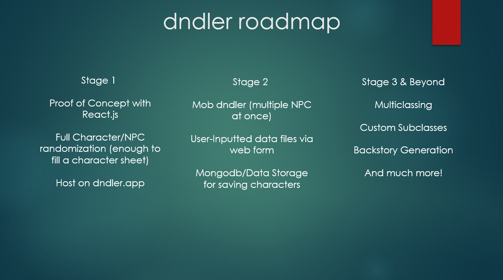

# dndler
The dndler is a tool for creating improvized game materials for TTRPG campaigns.

# Usage
    yarn install
and to run the react client and api in parallel

    yarn start

the client runs on `localhost:3000` and the api on `localhost:8000`

`yarn workspace client start` to run the client alone and `yarn workspace server dev` for the api

have fun

# Currently Being Updated
As of June 1, 2022, the dndler is in the process of being rebuilt. A current iteration is working using React, but many more features exist on our roadmap.

### Goal
Many TTRPGs involve frequent mixing of pre-written game materials and pure improvization. The dndler hopes to simplify the improvizational aspect where applicable, such as players wanting to create random characters for one-shots or DMs trying to create multiple NPCs at once (with names and personalities included, not just a skeleton).